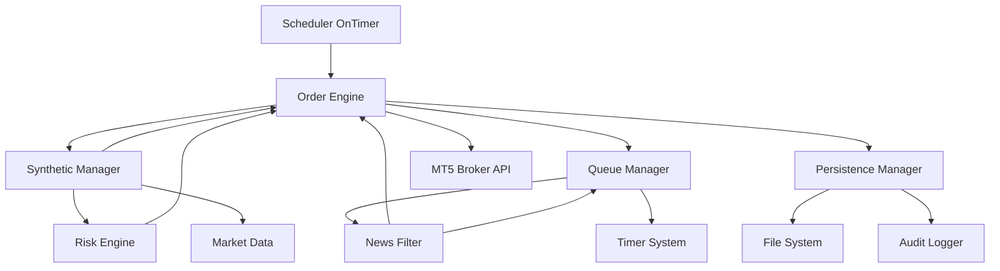
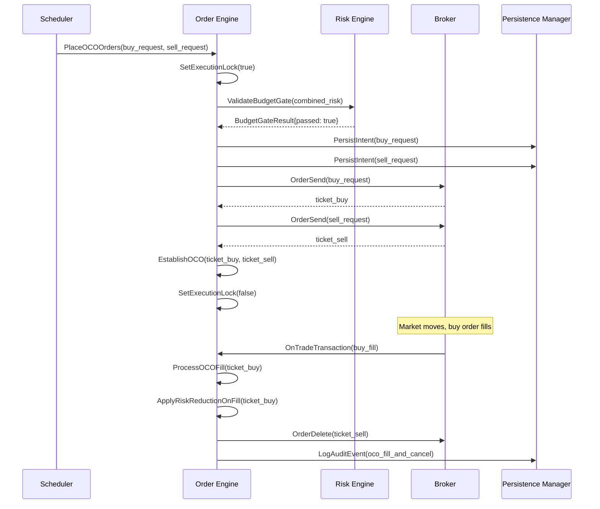
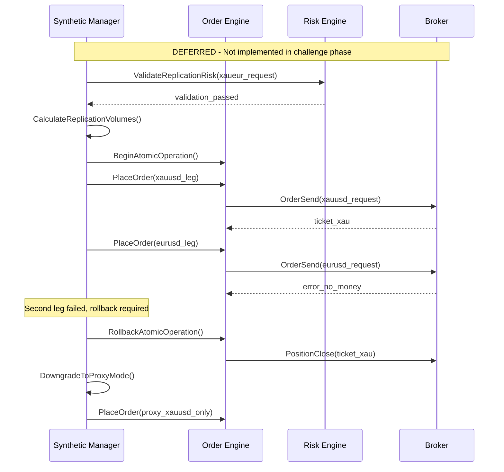
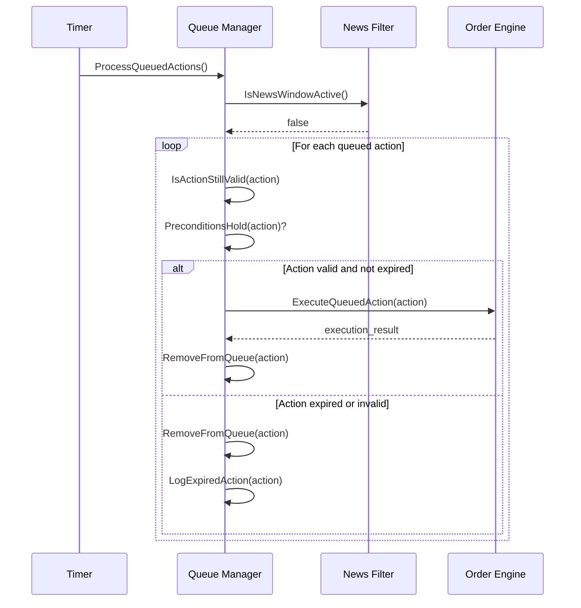

# Design Document

## Scope and Deferred Features

### ✅ IN SCOPE (Challenge Phase - 24 Tasks)

**Core Order Engine (Tasks 1-10):**
- Order placement with position limits
- OCO relationship management with expiry enforcement
- Partial fill handling with OCO volume adjustment
- Retry logic with MT5 error code mapping
- Market order fallback with slippage protection
- Volume/price normalization
- Idempotency system with intent journal
- Budget gate with position snapshot locking
- News CSV fallback system

**XAUEUR Signal Generation (Task 11):**
- Synthetic price calculation (XAUUSD/EURUSD) for BWISC signal generation
- Synthetic OHLC bar building for indicator calculations
- **SIGNAL SOURCE ONLY** - not for execution

**Queue & Trailing (Tasks 12-13):**
- News window action queuing with TTL management
- Trailing stop management with queue integration
- Post-news execution with precondition validation

**Integration & Polish (Tasks 14-17):**
- Comprehensive audit logging
- Integration with existing risk management
- **Simple XAUEUR signal mapping**: When BWISC generates signal from XAUEUR data → execute on XAUUSD with SL/TP distances scaled by EURUSD rate
- State recovery and reconciliation
- Error handling and resilience

**Performance Enhancements (Tasks 21-24):**
- Dynamic position sizing based on confidence
- Spread filter for liquidity check
- Breakeven stop at +0.5R
- Pending order expiry optimization (45 minutes)

### ❌ DEFERRED (Post-Challenge)

**Atomic Operation Manager** (~300 lines):
- Two-leg atomic operations with counter-order rollback
- Complex transaction management for multi-leg trades
- Only needed for replication mode execution
- **Rationale**: Adds complexity without proven benefit during challenge

**Replication Margin Calculator** (~200 lines):
- Margin calculations for two-leg replication trades
- Complex sizing logic for correlated pairs
- Delta-based hedge ratio calculations
- **Rationale**: Not needed for proxy-only execution

**XAUEUR Proxy Mode (Formal Implementation)** (~280 lines):
- Formal proxy mode with complex distance mapping
- Sophisticated SL/TP transformation logic
- **Replaced with**: Simple signal mapping in Task 15 (multiply SL/TP distances by EURUSD rate)
- **Rationale**: Simple mapping achieves same goal with 10 lines vs 280 lines

**XAUEUR Replication Mode** (~300 lines):
- Two-leg replication with delta-based sizing
- Execute both XAUUSD and EURUSD legs simultaneously
- Hedge ratio calculations and rebalancing
- Atomic two-leg coordination
- **Rationale**: Too complex for challenge phase, uncertain benefit

**Total Deferred Complexity**: ~1,080 lines of code, 4 major tasks, 5-7 days of work

### 🎯 Simplified XAUEUR Approach (Challenge Phase)

**What We're Building:**
1. **Task 11**: Calculate XAUEUR synthetic prices (XAUUSD/EURUSD) for BWISC signal generation
2. **Task 15**: When BWISC generates a signal from XAUEUR data → execute on XAUUSD as proxy
3. **Simple Mapping**: Scale SL/TP distances by current EURUSD rate (e.g., 50 pip SL on XAUEUR → 50 * 1.08 = 54 pip SL on XAUUSD)

**What We're NOT Building:**
- No two-leg trades (XAUUSD + EURUSD simultaneously)
- No atomic operations or rollback logic
- No complex margin calculations
- No formal proxy mode infrastructure
- No replication mode at all

**Implementation Guidance for AI Agent:**
- If you see references to "AtomicOrderManager", "ReplicationMarginCalculator", or "two-leg execution" in this design doc → **IGNORE THEM**
- These are deferred features documented for future reference
- Focus only on the 24 tasks in tasks.md
- XAUEUR is a signal source only; execution is simple XAUUSD orders with scaled SL/TP

---

## Overview

RPEA M3 implements the Order Engine and Synthetic Cross Support components, providing robust order execution capabilities with OCO pending orders, market fallbacks, trailing stops, and synthetic XAUEUR cross-pair support for signal generation. The design emphasizes comprehensive error handling, idempotency, and seamless integration with existing risk management and news compliance systems.

The architecture follows a modular approach with clear separation of concerns: the Order Engine handles all broker interactions and order lifecycle management, while the Synthetic Manager provides price calculation for signal generation only. Both components integrate tightly with the existing Risk Engine and News Filter to ensure compliance and safety.

## Architecture

### Event Model and Execution Context

#### OnInit
- Restore persisted state from intent journal
- Reconcile existing positions and orders with broker state
- Initialize OCO relationship tracking
- Load configuration and validate parameters
- Set up audit logging and file handles

#### OnTick (Fast Path)
- Reconcile state after fills already handled by OnTradeTransaction
- Update trailing stops for active positions when not blocked by news
- Sweep for lingering partial fill effects and housekeeping
- Execute time-critical protective actions

#### OnTradeTransaction (Immediate Broker Events)
- Capture fills and partial fills as they occur
- Trigger OCO sibling cancellation or risk-reduction resizing immediately
- Update partial fill aggregates and risk exposure before the next timer tick
- Queue trailing or SL/TP adjustments that are blocked by news buffers
- Append audit trail entries for fills, cancellations, and risk actions

#### OnTimer (Scheduled Processing)
- Process queued actions after news windows with precondition checks
- Execute retry attempts for failed orders
- Clean up expired queue items and stale intents
- Perform periodic state persistence
- Update synthetic price caches

#### OnDeinit
- Flush all pending audit log entries
- Persist current state to intent journal
- Close file handles and cleanup resources
- Log shutdown status and statistics

### Module Boundaries

#### Order Engine (`order_engine.mqh`)
- **Responsibility**: All broker order operations, OCO management (expiry enforcement and risk-reduction safety), trailing stops, retry logic
- **Public Interface**: `PlaceOrder()`, `ModifyOrder()`, `CancelOrder()`, `UpdateTrailing()`, `ProcessQueue()`
- **Dependencies**: Risk Engine, News Filter, Persistence Layer
- **State**: Active orders map, OCO relationships with expiry metadata, queued actions, execution locks

#### Synthetic Manager (`synthetic.mqh`)
 - **Responsibility**: XAUEUR synthetic price calculation and XAUEUR→XAUUSD signal mapping only (signal source; no two-leg execution)
 - **Public Interface**: `GetSyntheticPrice()`, `BuildSyntheticBars()`, `ScaleSyntheticDistance()`
 - **Dependencies**: Risk Engine, Market Data
 - **State**: Synthetic price cache; no replication or position tracking in M3

#### Queue Manager (within Order Engine)
- **Responsibility**: News-window action queuing for trailing and SL/TP optimizations, TTL management, post-news execution
- **Public Interface**: `QueueAction()`, `ProcessExpiredActions()`, `ExecuteQueuedActions()`
- **Dependencies**: News Filter, Timer System
- **State**: Action queue with timestamps, TTL tracking, pending validity flags

#### Persistence Manager (`persistence.mqh`)
- **Responsibility**: Order intent journaling, state recovery, audit logging
- **Public Interface**: `PersistIntent()`, `RestoreIntents()`, `LogAuditEvent()`, `ReconcileState()`
- **Dependencies**: File System, JSON Parser
- **State**: Intent journal, audit buffer, recovery flags

### Component Interactions



## Components and Interfaces

### Order Engine Interface

```cpp
class OrderEngine {
public:
    // Primary order operations
    struct OrderRequest {
        string symbol;
        ENUM_ORDER_TYPE type;
        double volume;
        double price;
        double sl;
        double tp;
        int magic;
        string comment;
        bool is_oco_primary;
        ulong oco_sibling_ticket;
        datetime expiry;
    };
    
    struct OrderResult {
        bool success;
        ulong ticket;
        string error_message;
        double executed_price;
        double executed_volume;
        int retry_count;
    };
    
    OrderResult PlaceOrder(const OrderRequest& request);
    bool ModifyOrder(ulong ticket, double sl, double tp);
    bool CancelOrder(ulong ticket, string reason);
    
    // OCO management
    bool EstablishOCO(ulong primary_ticket, ulong secondary_ticket);
    bool ProcessOCOFill(ulong filled_ticket);
    bool ApplyRiskReductionOnFill(ulong filled_ticket);
    
    // Trailing stops
    bool UpdateTrailing(ulong ticket, double new_sl);
    void ProcessAllTrailing();
    
    // Queue management for news windows
    bool QueueAction(const QueuedAction& action);
    void ProcessQueuedActions();
    bool ValidateQueuedAction(const QueuedAction& action);
    
    // State management
    bool IsExecutionLocked();
    void SetExecutionLock(bool locked);
    bool ReconcileOnStartup();
};

struct QueuedAction {
    ENUM_ACTION_TYPE type;  // TRAILING_UPDATE, SL_MODIFY, TP_MODIFY
    ulong ticket;
    double new_value;
    double validation_threshold;  // e.g., required R multiple or price check
    datetime queued_time;
    datetime expires_time;
    string trigger_condition;
};
```

### Synthetic Manager Interface

**⚠️ IMPLEMENTATION NOTE**: For challenge phase (Tasks 11 & 15), implement ONLY the price calculation and signal mapping functions. The execution functions (ExecuteSyntheticOrder, ValidateReplicationRisk, etc.) are deferred to post-challenge.

```cpp
// ✅ IMPLEMENT THESE (Task 11 - Signal Generation)
class SyntheticManager {
public:
    // Price calculation for BWISC signal generation
    double GetSyntheticPrice(string synthetic_symbol, ENUM_APPLIED_PRICE price_type);
    bool BuildSyntheticBars(string synthetic_symbol, ENUM_TIMEFRAMES timeframe, int count);
    bool AreQuotesStale(string symbol1, string symbol2);
    
private:
    // XAUEUR = XAUUSD / EURUSD
    double CalculateXAUEURPrice(ENUM_APPLIED_PRICE price_type);
    datetime GetLastTickTime(string symbol);
    static const int MAX_QUOTE_AGE_MS = 5000;
};

// ✅ IMPLEMENT THIS (Task 15 - Simple Signal Mapping)
// When signal_symbol == "XAUEUR":
//   1. Execute on "XAUUSD" 
//   2. Scale SL/TP distances: distance_xauusd = distance_xaueur * EURUSD_rate
//   3. Example: 50 pip SL on XAUEUR → 50 * 1.08 = 54 pip SL on XAUUSD
double ScaleSyntheticDistance(double xaueur_distance, double eurusd_rate);

// ❌ DEFERRED - DO NOT IMPLEMENT (Post-Challenge)
/*
class SyntheticManager {
    struct SyntheticOrderRequest { ... };
    struct SyntheticResult { ... };
    
    SyntheticResult ExecuteSyntheticOrder(const SyntheticOrderRequest& request);
    bool ValidateReplicationRisk(const SyntheticOrderRequest& request);
    bool CloseReplicationPosition(const vector<ulong>& tickets);
    double CalculateReplicationMargin(double xau_volume, double eur_volume);
    double MapSyntheticToProxy(string synthetic_symbol, double synthetic_distance);
    ulong ExecuteProxyOrder(const SyntheticOrderRequest& request);
};
*/
```

### Risk Integration Interface

```cpp
struct BudgetGateResult {
    bool passed;
    double open_risk;
    double pending_risk;
    double next_trade_risk;
    double room_today;
    double room_overall;
    double gate_threshold;  // 0.9 * min(room_today, room_overall)
};

BudgetGateResult ValidateBudgetGate(double proposed_risk);
bool CheckPositionLimits(string symbol, ENUM_ORDER_TYPE type);
double CalculateWorstCaseRisk(const OrderRequest& request);
```

## Data Models

### Order Intent Journal with Idempotency

```json
{
  "intents": [
    {
      "intent_id": "rpea_20240115_103000_001",
      "timestamp": "2024-01-15T10:30:00Z",
      "symbol": "XAUUSD",
      "order_type": "BUY_LIMIT",
      "volume": 0.1,
      "price": 2050.50,
      "sl": 2040.00,
      "tp": 2070.00,
      "expiry": "2024-01-15T11:00:00Z",
      "status": "PENDING|EXECUTED|FAILED|CANCELLED",
      "execution_mode": "PROXY|DIRECT", // "REPLICATION" reserved for post-challenge work
      "oco_sibling_id": "rpea_20240115_103000_002",
      "retry_count": 0,
      "error_messages": [],
      "executed_tickets": [],
      "partial_fills": [],
      "accept_once_key": "symbol_ordertype_timestamp_hash"
    }
  ],
  "queued_actions": [
    {
      "action_id": "rpea_trail_20240115_103500_001",
      "ticket": 12345,
      "action_type": "TRAILING_UPDATE",
      "new_value": 2045.00,
      "queued_time": "2024-01-15T10:35:00Z",
      "expires_time": "2024-01-15T10:40:00Z",
      "trigger_condition": "news_window_end",
      "validation_threshold": 1.0,
      "accept_once_key": "ticket_actiontype_newvalue_hash"
    }
  ]
}
```

### OCO Relationship Tracking

```cpp
struct OCORelationship {
    ulong primary_ticket;
    ulong secondary_ticket;
    datetime established_time;
    datetime expiry_time;
    bool is_active;
    string symbol;
    double primary_volume;
    double secondary_volume;
};

map<ulong, OCORelationship> active_oco_relationships;
```

### Synthetic Position Tracking

**❌ DEFERRED – Post-challenge (Not implemented in M3)**

```cpp
// Deferred to post-challenge replication work. No synthetic position tracking in M3.
struct SyntheticPosition {
    string synthetic_symbol;
    vector<ulong> leg_tickets;
    ENUM_EXECUTION_MODE mode;  // PROXY or REPLICATION
    double total_volume;
    double combined_margin;
    datetime open_time;
    bool is_active;
};

map<string, vector<SyntheticPosition>> synthetic_positions;
```

## Error Handling

### Retry Logic Framework with Error Code Mapping

```cpp
enum RETRY_POLICY {
    FAIL_FAST,           // NO_MONEY, TRADE_DISABLED
    EXPONENTIAL_BACKOFF, // Network errors, temporary failures
    LINEAR_BACKOFF       // Market closed, requotes
};

struct RetryConfig {
    int max_attempts;
    int initial_delay_ms;
    double backoff_multiplier;
    int max_backoff_ms;
    map<int, RETRY_POLICY> error_policy_map;
};

// MT5 Trade Result Code Mapping
map<int, RETRY_POLICY> DEFAULT_ERROR_POLICIES = {
    // Fail Fast - Don't retry
    {TRADE_RETCODE_NO_MONEY, FAIL_FAST},
    {TRADE_RETCODE_TRADE_DISABLED, FAIL_FAST},
    {TRADE_RETCODE_POSITION_CLOSED, FAIL_FAST},
    {TRADE_RETCODE_INVALID_VOLUME, FAIL_FAST},
    {TRADE_RETCODE_INVALID_PRICE, FAIL_FAST},
    
    // Exponential Backoff - Network/Server issues
    {TRADE_RETCODE_CONNECTION, EXPONENTIAL_BACKOFF},
    {TRADE_RETCODE_TIMEOUT, EXPONENTIAL_BACKOFF},
    {TRADE_RETCODE_SERVER_DISABLES_AT, EXPONENTIAL_BACKOFF},
    
    // Linear Backoff - Market conditions
    {TRADE_RETCODE_MARKET_CLOSED, LINEAR_BACKOFF},
    {TRADE_RETCODE_REQUOTE, LINEAR_BACKOFF},
    {TRADE_RETCODE_PRICE_CHANGED, LINEAR_BACKOFF},
    {TRADE_RETCODE_PRICE_OFF, LINEAR_BACKOFF}
};

class RetryManager {
    bool ShouldRetry(int error_code, int attempt_count);
    int CalculateDelay(int attempt_count, RETRY_POLICY policy);
    void LogRetryAttempt(const OrderRequest& request, int attempt, int error_code);
    RETRY_POLICY GetPolicyForError(int error_code);
};
```

### Atomic Operation Rollback with Explicit Counter-Orders

**❌ DEFERRED - DO NOT IMPLEMENT THIS SECTION**

This entire section is deferred to post-challenge. It's documented here for future reference only.

```cpp
// ❌ DEFERRED - DO NOT IMPLEMENT
class AtomicOrderManager {
    struct AtomicOperation {
        string operation_id;
        vector<OrderRequest> requests;
        vector<ulong> executed_tickets;
        vector<double> executed_volumes;
        bool is_complete;
        datetime start_time;
        string rollback_reason;
    };
    
    bool ExecuteAtomicOrders(const vector<OrderRequest>& requests);
    void RollbackPartialExecution(AtomicOperation& operation);
    bool ValidateAtomicPreconditions(const vector<OrderRequest>& requests);
    
private:
    // Explicit rollback using counter-orders
    bool ClosePositionByCounterOrder(ulong ticket, double volume);
    bool CancelPendingOrder(ulong ticket);
    void LogRollbackAction(const AtomicOperation& operation, string action, bool success);
    
    struct CounterOrderRequest {
        ulong original_ticket;
        string symbol;
        ENUM_ORDER_TYPE counter_type;  // Opposite of original
        double volume;
        double max_slippage;
    };
    
    bool ExecuteCounterOrder(const CounterOrderRequest& request);
};
```

### Partial Fill Handling with OCO Adjustment

```cpp
struct PartialFillData {
    ulong ticket;
    double requested_volume;
    double filled_volume;
    double remaining_volume;
    double avg_fill_price;
    datetime fill_time;
};

class PartialFillManager {
    // Called from OnTradeTransaction to maintain immediate consistency
    void ProcessPartialFill(const PartialFillData& fill_data);
    void AdjustOCOSibling(ulong sibling_ticket, double new_volume);
    void RecalculateSLTP(ulong ticket, double new_volume, double avg_price);
    
    // Fill aggregation for multiple partial fills
    void AggregatePartialFills(ulong ticket, const PartialFillData& new_fill);
    bool IsOrderFullyFilled(ulong ticket);
    
    // Last-share rules
    bool IsLastShareFill(const PartialFillData& fill_data);
    void HandleLastShareFill(ulong ticket);
};

// Exact math for OCO volume adjustment
double CalculateAdjustedOCOVolume(double original_sibling_volume, 
                                  double primary_requested_volume,
                                  double primary_filled_volume) {
    double fill_ratio = primary_filled_volume / primary_requested_volume;
    return NormalizeVolume(original_sibling_volume * fill_ratio);
}
```

### Volume and Price Normalization

```cpp
class VolumeManager {
    double NormalizeVolume(string symbol, double volume);
    double NormalizePrice(string symbol, double price);
    bool ValidateVolumeRange(string symbol, double volume);
    double CalculateSlippagePoints(string symbol, double requested_price, double executed_price);
    
private:
    double GetVolumeStep(string symbol);
    double GetMinVolume(string symbol);
    double GetMaxVolume(string symbol);
    double GetPointSize(string symbol);
    int GetDigits(string symbol);
};

// Implementation details
double VolumeManager::NormalizeVolume(string symbol, double volume) {
    double step = SymbolInfoDouble(symbol, SYMBOL_VOLUME_STEP);
    double min_vol = SymbolInfoDouble(symbol, SYMBOL_VOLUME_MIN);
    double max_vol = SymbolInfoDouble(symbol, SYMBOL_VOLUME_MAX);
    
    // Round to nearest step
    double normalized = MathRound(volume / step) * step;
    
    // Clamp to valid range
    return MathMax(min_vol, MathMin(max_vol, normalized));
}
```

### Budget Gate with Position Snapshot

```cpp
struct BudgetGateSnapshot {
    datetime snapshot_time;
    double open_risk;
    double pending_risk;
    double room_today;
    double room_overall;
    vector<ulong> position_tickets;
    vector<ulong> pending_tickets;
    bool is_locked;
};

class BudgetGateManager {
    BudgetGateResult ValidateBudgetGateWithSnapshot(double proposed_risk);
    BudgetGateSnapshot TakePositionSnapshot();
    void ReleaseBudgetGateLock();
    
private:
    bool AcquireBudgetGateLock(int timeout_ms);
    double CalculateOpenRisk(const vector<ulong>& position_tickets);
    double CalculatePendingRisk(const vector<ulong>& pending_tickets);
    
    static const int BUDGET_GATE_LOCK_TIMEOUT_MS = 1000;
    bool budget_gate_locked;
    datetime lock_acquired_time;
};
```

### News CSV Fallback with Schema Validation

```cpp
struct NewsEvent {
    datetime event_time;
    string impact;        // "High", "Medium", "Low"
    string countries;     // "USD,EUR,GBP"
    string symbols;       // "EURUSD,GBPUSD,XAUUSD"
    string description;
    bool is_valid;
};

class NewsCSVParser {
    vector<NewsEvent> LoadNewsFromCSV(string csv_path);
    bool ValidateCSVSchema(string csv_path);
    bool IsCSVStale(string csv_path, int max_age_hours);
    
    // Required CSV Schema (M3): timestamp_utc,symbol,impact,source,event,prebuffer_min,postbuffer_min
    // Example: 2024-01-15T14:30:00Z,XAUUSD,High,ForexFactory,NFP,5,5
    
private:
    bool ParseCSVLine(string line, NewsEvent& event);
    bool ValidateEventFields(const NewsEvent& event);
    datetime ParseTimestamp(string timestamp_str);
    
    static const string CSV_DELIMITER = ",";
    // CSV path comes from config: NewsCSVPath
    // Staleness max age comes from config: NewsCSVMaxAgeHours
};
```

### Synthetic Price Staleness and Margin Model

**⚠️ PARTIAL IMPLEMENTATION**: Implement only SyntheticPriceManager (Task 11). ReplicationMarginCalculator is deferred.

```cpp
// ✅ IMPLEMENT THIS (Task 11)
class SyntheticPriceManager {
    double GetSyntheticPrice(string synthetic_symbol, ENUM_APPLIED_PRICE price_type);
    bool AreQuotesStale(string symbol1, string symbol2);
    bool ValidateQuoteAge(string symbol, int max_age_ms);
    
private:
    datetime GetLastTickTime(string symbol);
    // Read max age from config: QuoteMaxAgeMs
};

// ❌ DEFERRED - DO NOT IMPLEMENT (Post-Challenge)
/*
class ReplicationMarginCalculator {
    double CalculateReplicationMargin(double xau_volume, double eur_volume);
    bool ValidateMarginAvailability(double required_margin);
    bool ShouldDowngradeToProxy(double required_margin);
    
    // Exact replication margin formula with 20% buffer
    double CalculateExactMargin(double xau_volume, double eur_volume) {
        double xau_margin = xau_volume * ContractXAU * GetXAUUSDPrice() / GetLeverage("XAUUSD");
        double eur_margin = eur_volume * ContractFX / GetLeverage("EURUSD");
        double total_margin = xau_margin + eur_margin;
        return total_margin * 1.20; // 20% buffer
    }
    
private:
    double GetLeverage(string symbol);
    double GetFreeMargin();
    static const double MARGIN_BUFFER_PCT = 0.20;
    static const double MARGIN_THRESHOLD_PCT = 0.60; // 60% of free margin
};
*/
```

### Queue Management with Bounds and Back-pressure

```cpp
class BoundedQueueManager {
    bool QueueAction(const QueuedAction& action);
    void ProcessExpiredActions();
    void ExecutePostNewsActions();
    bool IsActionStillValid(const QueuedAction& action);
    bool PreconditionsHold(const QueuedAction& action);
    void CleanupExpiredActions();
    
private:
    // Use config keys instead of hardcoded constants
    // MaxQueueSize (int), QueueTTLMinutes (int), EnableQueuePrioritization (bool)
    vector<QueuedAction> action_queue;
    
    // Back-pressure policy when queue is full
    bool HandleQueueOverflow(const QueuedAction& new_action);
    void EvictOldestActions(int count);
    void PrioritizeActions(); // Trailing updates get priority
};
```

### Audit Log Schema

```cpp
struct AuditLogEntry {
    string intent_id;
    datetime timestamp;
    string symbol;
    string action_type;        // "ORDER_PLACE", "ORDER_MODIFY", "ORDER_CANCEL", "POSITION_CLOSE"
    vector<ulong> tickets;
    double requested_volume;
    double executed_volume;
    double requested_price;
    double executed_price;
    double sl;
    double tp;
    int retry_count;
    string execution_mode;     // "PROXY", "REPLICATION", "DIRECT"
    // M3 usage: "PROXY" for XAUEUR-derived executions (mapped to XAUUSD), "DIRECT" for native symbols.
    // "REPLICATION" reserved for post-challenge; not used in M3.
    
    // Budget gate inputs
    double open_risk;
    double pending_risk;
    double next_trade_risk;
    double room_today;
    double room_overall;
    bool budget_gate_passed;

    double confidence;
    double efficiency;
    double est_value;
    double hold_time;
    string gating_reason;
    string news_window_state;

    
    string decision_reason;
    string error_message;
    int error_code;
};

// CSV Schema
// intent_id,timestamp,symbol,action_type,tickets,requested_volume,executed_volume,
// requested_price,executed_price,sl,tp,retry_count,execution_mode,open_risk,
// pending_risk,next_trade_risk,room_today,room_overall,budget_gate_passed,\r\n// confidence,efficiency,est_value,hold_time,gating_reason,news_window_state,decision_reason,error_message,error_code

// Sample CSV Row
// rpea_20240115_103000_001,2024-01-15 10:30:00.123,XAUUSD,ORDER_PLACE,"12345;12346",
// 0.10,0.10,2050.50,2050.45,2040.00,2070.00,0,PROXY,150.50,75.25,105.00,
// 400.00,600.00,true,0.82,0.78,1.95,540,"London bias gate","CLEAR","Signal BC setup",,"0"
```

### News Window Queue Processing

```cpp
class NewsQueueProcessor {
    void QueueDuringNewsWindow(const QueuedAction& action);
    void ProcessExpiredActions();
    void ExecutePostNewsActions();
    bool IsActionStillValid(const QueuedAction& action);
    bool PreconditionsHold(const QueuedAction& action);
    void CleanupExpiredActions();
};
```

## Testing Strategy

### Unit Tests

1. **Order Engine Core**
   - OCO establishment and cancellation logic
   - Retry mechanism with different error codes
   - Queue management and TTL expiration
   - Execution lock behavior

2. **Synthetic Manager**
   - XAUEUR synthetic price calculation accuracy (XAUUSD/EURUSD)
   - Synthetic bar gap fill and cache management
   - Quote staleness detection (QuoteMaxAgeMs)
   - Distance scaling helper (XAUEUR → XAUUSD)

3. **Risk Integration**
   - Budget gate formula validation
   - Position limit enforcement
   - Worst-case risk calculations

### Integration Tests

1. **End-to-End Order Flow**
   - Signal → Risk Check → Order Placement → Execution
   - OCO fill triggering sibling cancellation
   - News window queuing and post-news execution

2. **Synthetic Cross Operations**
- XAUEUR signal mapping to XAUUSD (proxy-only)
- Verify EURUSD-scaled SL/TP distances
- No replication, no rollback in M3

3. **Error Recovery**
   - System restart with pending intents
   - Partial fill handling and OCO adjustment
   - Network failure during queued action execution

### Stress Tests

1. **High-Frequency Scenarios**
   - Multiple simultaneous order requests
   - Rapid OCO fills and cancellations
   - Queue overflow during extended news windows

2. **Failure Scenarios**
   - Broker API unavailability
   - Insufficient margin conditions
   - Market closure during execution

### Test Framework and Deterministic Testing

```cpp
class FakeBrokerLayer {
    // Deterministic test environment
    void SetTestSeed(int seed);
    void SimulateOrderFill(ulong ticket, double volume, double price);
    void SimulateOrderReject(ulong ticket, int error_code);
    void SimulatePartialFill(ulong ticket, double partial_volume);
    void SimulateNetworkDelay(int delay_ms);
    
    // Market condition simulation
    void SetMarketClosed(bool closed);
    void SetInsufficientMargin(bool insufficient);
    void SimulateSlippage(double max_slippage_points);
    
    // Deterministic behavior
    map<string, double> fixed_prices;
    map<int, bool> error_simulation_flags;
    int current_test_seed;
};

// Test configuration for deterministic results
struct TestConfig {
    int random_seed = 12345;
    bool enable_fake_broker = false;
    string test_data_path = "Files/RPEA/test_data/";
    bool log_all_test_actions = true;
    int simulation_speed_multiplier = 1;
};
```

## Configuration Parameters

### Order Engine Configuration

```cpp
// Retry and timing
input int MaxRetryAttempts = 3;
input int InitialRetryDelayMs = 300;
input double RetryBackoffMultiplier = 2.0;
input int QueuedActionTTLMin = 5;

// Execution controls
input double MaxSlippagePoints = 10.0;
input int MinHoldSeconds = 120;
input bool EnableExecutionLock = true;
input int PendingExpiryMinutes = 45; // Task 24: expire pendings 45 minutes after placement

// OCO settings
input bool AutoCancelOCOSibling = true;
input int OCOCancellationTimeoutMs = 1000;
input bool EnableRiskReductionSiblingCancel = true;

// Logging
input bool EnableDetailedLogging = true;
input string AuditLogPath = "Files/RPEA/logs/";
input int LogBufferSize = 1000;
```

### Synthetic Manager Configuration

```cpp
// ✅ IMPLEMENT THESE (Task 11 - Signal Generation)
// Synthetic price calculation
input int SyntheticBarCacheSize = 1000;
input bool ForwardFillGaps = true;
input int MaxGapBars = 5;
input int QuoteMaxAgeMs = 5000; // Max age for XAUUSD/EURUSD quotes

// ✅ IMPLEMENT THESE (Task 15 - Signal Mapping)
// When BWISC generates XAUEUR signal → execute on XAUUSD with scaled SL/TP
// No additional config needed, just use current EURUSD rate for scaling

// ✅ IMPLEMENT THESE (Other M3 Tasks)
// News and timing
input string NewsCSVPath = "Files/RPEA/news/calendar_high_impact.csv";
input int NewsCSVMaxAgeHours = 24;
input int BudgetGateLockMs = 1000;
input double RiskGateHeadroom = 0.90; // 90% of available room

// Queue management
input int MaxQueueSize = 1000;
input int QueueTTLMinutes = 5;
input bool EnableQueuePrioritization = true;

// ❌ DEFERRED - DO NOT IMPLEMENT
/*
// Mode selection (dynamic - replication attempted first when margin allows)
input bool UseXAUEURProxy = true;  // Default mode, but system attempts replication first
input double ReplicationMarginThreshold = 0.6; // 60% of free margin

// Replication parameters
input double ContractXAU = 100.0;  // oz per lot
input double ContractFX = 100000.0; // units per lot
input double DeltaTolerancePct = 0.05; // 5% delta tolerance
input double MarginBufferPct = 0.20; // 20% margin buffer

// Risk mapping
input double ProxyRiskMultiplier = 1.0;
input bool EnableReplicationFallback = true;
*/
```

## Risks and Mitigations

### Risk 1: OCO Race Conditions
**Description**: Simultaneous fills of OCO orders due to timing issues
**Mitigation**: Execution locks and atomic OCO state updates
**Test**: Concurrent order simulation with rapid fills
**Guard**: `IsExecutionLocked()` checks before any OCO operations

### Risk 2: Replication Atomicity Failure
**❌ DEFERRED – Not applicable to M3**
**Description (post-challenge)**: First leg executes but second leg fails, leaving unhedged exposure
**Mitigation**: Immediate rollback of first leg on second leg failure
**Test**: Simulated broker failures during two-leg execution
**Guard**: `AtomicOrderManager` with rollback capability

### Risk 3: News Queue Overflow
**Description**: Extended news windows causing queue memory issues
**Mitigation**: TTL-based queue cleanup and size limits
**Test**: Simulate 24-hour news window with continuous queue additions
**Guard**: `MAX_QUEUE_SIZE` limit and automatic cleanup

### Risk 4: Synthetic Price Calculation Errors
**Description**: Stale or incorrect EURUSD rates affecting XAUEUR calculations
**Mitigation**: Real-time rate validation and staleness checks
**Test**: Inject stale price data and verify error handling
**Guard**: Price age validation before synthetic calculations

### Risk 5: Budget Gate Calculation Drift
**Description**: Concurrent position changes affecting budget gate accuracy
**Mitigation**: Atomic budget gate validation with position locks
**Test**: Rapid position changes during budget gate checks
**Guard**: Position state snapshots during validation

### Risk 6: Persistence Corruption
**Description**: Intent journal corruption causing state recovery failures
**Mitigation**: JSON schema validation and backup files
**Test**: Corrupt intent files and verify recovery behavior
**Guard**: File integrity checks on startup

### Risk 7: Margin Calculation Errors in Replication
**❌ DEFERRED – Not applicable to M3**
**Description (post-challenge)**: Incorrect margin estimates leading to failed executions on two-leg trades
**Mitigation**: Conservative margin buffers and real-time validation
**Test**: Edge cases with high leverage and volatile markets
**Guard**: 20% margin buffer above calculated requirements

### Risk 8: Trailing Stop Lag During High Volatility
**Description**: Delayed trailing updates causing suboptimal exits
**Mitigation**: Priority queuing for trailing updates
**Test**: High-frequency price movements with active trailing
**Guard**: Maximum trailing update delay monitoring

## Sequence Diagrams

### OCO Order Placement and Fill



### Synthetic Replication with Rollback

**❌ DEFERRED - This sequence diagram is for post-challenge reference only**



### News Window Queue Processing



This design provides a robust foundation for implementing the Order Engine and Synthetic Cross Support components with comprehensive error handling, clear module boundaries, and thorough risk mitigation strategies.

---

## Implementation Guidance Summary for AI Coding Agent

### ✅ What to Implement (24 Tasks)

**Core Order Engine:**
- Order placement, OCO management, partial fills, retry logic, market fallback
- Volume/price normalization, idempotency, budget gate, news CSV fallback
- Queue management, trailing stops, audit logging, state recovery

**XAUEUR (Simplified):**
- **Task 11**: Calculate XAUEUR synthetic prices (XAUUSD/EURUSD) for BWISC signal generation
- **Task 15**: Simple signal mapping - when signal_symbol == "XAUEUR" → execute on "XAUUSD" with SL/TP scaled by EURUSD rate

**Performance Enhancements:**
- Dynamic position sizing, spread filter, breakeven stop, pending expiry optimization

### ❌ What NOT to Implement (Deferred)

**Do not implement these even if you see them in this design doc:**
- `AtomicOrderManager` class and all atomic operation logic
- `ReplicationMarginCalculator` class and margin calculations
- `ExecuteSyntheticOrder()`, `ValidateReplicationRisk()`, `CloseReplicationPosition()`
- Two-leg execution, replication mode, formal proxy mode
- Any code related to "replication", "atomic", "two-leg", or "rollback"

**These sections are documented for future reference only.**

### 🎯 Key Simplifications

1. **XAUEUR is signal-only**: Calculate synthetic prices for BWISC, but execute on XAUUSD
2. **No two-leg trades**: Single XAUUSD order, not XAUUSD + EURUSD simultaneously
3. **Simple distance scaling**: `distance_xauusd = distance_xaueur * EURUSD_rate`
4. **No atomic operations**: No rollback logic, no transaction management
5. **No margin calculations**: Standard single-leg margin only

### 📋 Implementation Checklist

- [ ] Follow the 24 tasks in tasks.md sequentially
- [ ] Ignore any references to deferred features in this design doc
- [ ] For XAUEUR: implement only price calculation (Task 11) and simple signal mapping (Task 15)
- [ ] Do not implement AtomicOrderManager, ReplicationMarginCalculator, or related classes
- [ ] Focus on core order execution, OCO management, and trailing stops
- [ ] Test after each phase using Strategy Tester

**Total Scope**: 24 tasks, ~17-22 days, ~3,500 lines of code (vs 4,580 with deferred features)
