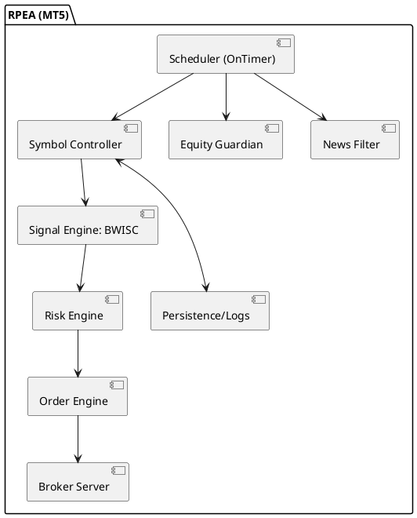
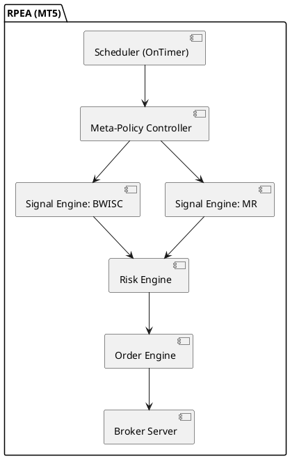
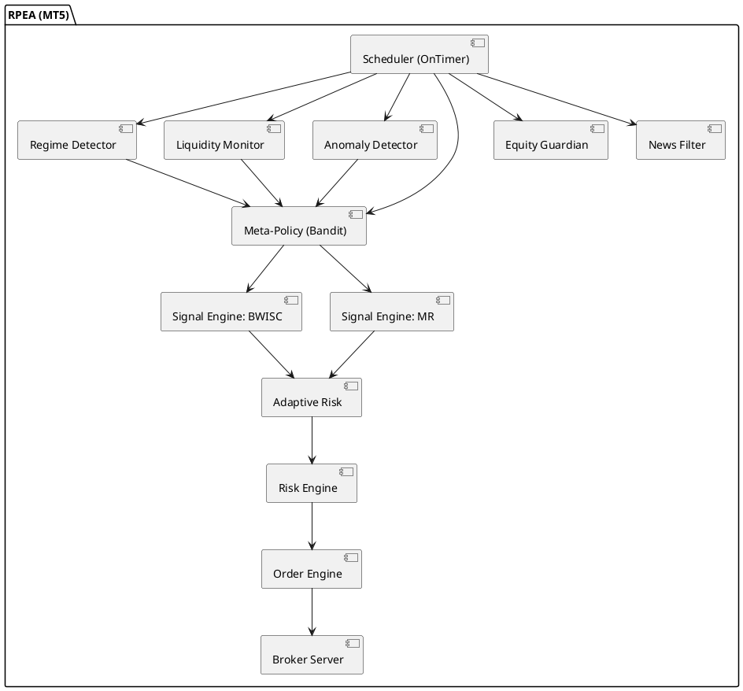

# RPEA - FundingPips 10K RapidPass EA for MT5

[](https://www.metatrader5.com)
[](LICENSE)
[]()

> **Expert Advisor designed to pass the FundingPips 1-step $10,000 challenge** by achieving +10% profit within 3-5 trading days while maintaining zero drawdown-cap violations and trading on ≥3 distinct trading days.

## 🎯 Objective

Pass the **FundingPips 1-step $10,000 challenge** under strict constraints:
- **Target**: +10% profit (+$1,000) within 3-5 trading days
- **Risk Limits**: Daily loss cap (4%) and overall loss cap (6%) of server-day anchored baseline
- **Requirements**: ≥3 distinct trading days, no news-window violations
- **Platform**: MetaTrader 5 (hedging or netting)
- **Leverage**: Up to 1:50 FX / 1:20 metals

## 🏗️ Architecture Overview

### Hybrid Ensemble Strategy System

RPEA implements a sophisticated **dual-engine architecture** combining complementary trading approaches:

#### Primary Engine: BWISC (Burst-Weighted Imbalance with Session Confluence)
- **Signal Generation**: Session-based bias from D1 BTR, SDR vs MA20_H1, OR energy, RSI guard
- **Setups**:
  - **Burst Capture (BC)**: |Bias| ≥ 0.6 → Stop beyond OR extreme, ATR SL, TP = SL × 2.2R
  - **Mean-Shift (MSC)**: |Bias| ∈ [0.35, 0.6) & SDR ≥ 0.35 → Limit toward MA20_H1, TP = SL × 2.0R
- **Risk Profile**: 1.5% per trade (default)

#### Secondary Engine: MR (Mean Reversion with EMRT/RL)
- **EMRT Formation**: Model-free metric quantifying spread reversion duration from local extremes
- **RL Policy**: Q-learning with 256-state space, epsilon-greedy action selection
- **Training**: Pre-trained on simulated OU processes and synthetic spread scenarios
- **Risk Profile**: 0.8-1.0% per trade

#### Meta-Policy Controller (Contextual Bandit)
- **Strategy Selection**: Thompson/LinUCB bandit choosing BWISC vs MR vs Skip
- **Context Vector**: Regime features, ORE/SDR, EMRT rank, efficiency, spread quantiles, news proximity
- **Primary = BWISC**: Default strategy selection prioritizes Burst-Weighted Imbalance with Session Confluence
- **Fallback = MR**: When BWISC yields no setup OR confidence tie-breaker triggers
- **Confidence Tie-breaker**: MR selected when BWISC_conf < 0.70 AND MR_conf > 0.80 AND efficiency(MR) ≥ efficiency(BWISC)
- **Conditional BWISC Replacement**: Replace BWISC for THIS session if ORE < p40 AND ATR_D1 < p50 AND EMRT ≤ H* (H*=p40 of EMRT lookback), session age <2h, no active/pending symbol overlaps, and no high-impact news ±15m; once switched, stay until session end (hysteresis)
- **Efficiency Calculation**: E[R]/WorstCaseRisk where R is expected return and WorstCaseRisk is risk at SL distance

### Advanced Risk Management Framework

#### Multi-Layer Protection System
- **Daily Caps**: 4% of server-day baseline (max(balance_at_server_midnight, equity_at_server_midnight))
- **Overall Caps**: 6% of initial baseline
- **Floor Protection**: Kill-switch closes all positions on breach, disables trading
- **Budget Gate**: open_risk + pending_risk + next_trade_worst_case ≤ 0.9 × min(room_today, room_overall)
- **Position Caps**: Max 2 total positions, 1 per symbol, 2 pending orders per symbol

#### Session Governance
- **London First**: Evaluate London session (07:00 server time)
- **One-and-Done**: Global exit if London win ≥ 1.5R (no NY trading across all symbols)
- **NY Gate**: NY allowed only if realized day loss ≤ 50% of daily cap
- **Opening Range**: 60-minute window for bias calculation

#### News Compliance (Account-Type Specific)
- **Master Accounts**: ±300s (5min) high-impact news window blocks entries/holding
- **Evaluation Accounts**: Internal buffer for safety (no provider restrictions)
- **Protective Actions**: SL/TP/kill-switch always allowed inside news windows
- **Queued Modifications**: Trailing/SL-TP updates applied post-news window

### Synthetic Cross Support: XAUEUR

Compute signals on **XAUEUR = XAUUSD/EURUSD** with two execution modes:

#### Proxy Mode (Default)
- Execute only XAUUSD, size using synthetic SL distance mapped via current EURUSD rate
- Simple margin management, fast execution

#### Replication Mode (Optional)
- Two-leg execution: Long XAUEUR ≈ Long XAUUSD + Short EURUSD
- Delta-based sizing: Volume calculations account for contract specifications
- Worst-case combined loss validation at SL

### Adaptive & Learning Enhancements

#### Market Regime Detection
- Classify symbol/sessions into trend/range/volatile/illiquid
- Adapt R targets, SL multipliers, trailing aggressiveness by regime
- Enable/disable MR in strong trends

#### Liquidity Intelligence
- Rolling spread/slippage quantiles per symbol/session
- Auto-pause symbols with adverse slippage patterns
- Entry gating above p75-p90 thresholds

#### Anomaly Detection
- EWMA z-scores for returns, spread spikes, tick gaps
- 5-6σ triggers: widen buffers, cancel pendings, flatten positions
- Auto-switch to CSV fallback during calendar API outages

## 🔒 Decisions & Constraints (LOCKED)

> These decisions are fixed to avoid mid-build refactors and ensure consistent implementation.

### News Policy (Account-Specific)
- **Evaluation (Student) accounts**: Provider imposes no news/weekend restrictions. Internal news buffer applied for safety.
- **Master (funded) accounts**: Enforce high-impact news lock on affected symbols:
  - Block opening and holding positions from **T−300s to T+300s** (5 minutes before/after)
  - Profits from trades opened/closed inside window won't count unless opened ≥5 hours prior
  - **Protective exits** (SL/TP/auto kill-switch/margin) **always allowed** inside window

### Session Order & Governance
- **London First**: Always evaluate London session (07:00 server time) before New York
- **One-and-Done**: Global exit if London win ≥ 1.5R (disables NY trading across all symbols)
- **NY Gate**: NY session allowed only if realized day loss ≤ 50% of daily cap (default 0.50 × DailyLossCapPct)

### Position & Order Management
- **Caps**: Max 2 total positions, 1 per symbol, 2 pending orders per symbol
- **Trading-Day Counting**: Day counts on first DEAL_ENTRY_IN between server-day midnights
- **State Persistence**: Initial baseline, gDaysTraded, last_counted_server_date persist across restarts

### Kill-Switch Floor Protection
- **Daily Floor**: baseline_today − DailyLossCapPct%
- **Overall Floor**: initial_baseline − OverallLossCapPct%
- **Breach Action**: Close ALL positions immediately, disable trading until next server day (daily) or permanently (overall)
- **News Bypass**: Floor breaches may bypass news/min-hold restrictions for protective exits

### Session Window Mechanics
- **Opening Range**: InSession(t0, ORMinutes) := TimeCurrent() ∈ [t0, t0 + ORMinutes×60] (interval-based, no hour-equality check)
- **Micro-Mode Scope**: Micro-trades run only in Micro-Mode (post-target) to meet MinTradeDays; never pre-target
- **R Calculation**: Persist {entry, sl, type} on open; compute R and win/loss from persisted values (not inferred from closed positions)

### Helper Surface Requirements
- **Core Utilities**: IsNewsBlocked(symbol), EquityRoomAllowsNextTrade(), MathSign(), MarkTradeDayOnce(), SpreadOK(sym)
- **DST Handling**: ServerToCEST_OffsetMinutes updated on DST flip (AutoCEST optional future enhancement)

---

## 📋 Prerequisites

### System Requirements
- **MetaTrader 5** terminal (build 3500+)
- **Windows/Linux/Mac** with MT5 compatibility
- **Minimum VPS specs**: 2 CPU cores, 4GB RAM (recommended for low latency)

### Broker Requirements
- **Leverage**: 1:50 for FX pairs, 1:20 for metals
- **Symbols**: EURUSD, XAUUSD (XAUEUR synthetic optional)
- **Execution**: ECN/STP account preferred
- **Commission**: Low spreads/commission structure

## 🚀 Quick Start

### 1. Installation
```bash
# Clone or download the RPEA project
# Copy to your MT5 Experts directory:
# MQL5/Experts/FundingPips/RPEA.mq5
# MQL5/Include/RPEA/*.mqh
# MQL5/Files/RPEA/* (for persistence and logs)
```

### 2. Initial Configuration
```cpp
// Key input parameters (see full list below)
input double DailyLossCapPct = 4.0;      // Daily loss limit %
input double OverallLossCapPct = 6.0;    // Overall loss limit %
input int MinTradeDaysRequired = 3;      // Minimum trading days
input double RiskPct = 1.5;              // Base risk per trade %
input string InpSymbols = "EURUSD;XAUUSD"; // Trading symbols
input bool UseXAUEURProxy = true;        // Use proxy mode for XAUEUR
```

### 3. Strategy Tester Setup
- **Deposit**: $10,000
- **Leverage**: 1:50 FX / 1:20 metals
- **Model**: Every tick based on real ticks
- **Period**: Recent 3-6 months with news events

### 4. Live Deployment
- Use demo account first for validation
- Set server-to-CEST offset for accurate day boundaries
- Configure news buffer (300s default for Master accounts)
- Enable comprehensive logging for audit trails

## ⚙️ Configuration Parameters

### Risk & Governance
| Parameter | Default | Description |
|-----------|---------|-------------|
| `DailyLossCapPct` | 4.0 | Daily loss limit as % of baseline |
| `OverallLossCapPct` | 6.0 | Overall loss limit as % of initial baseline |
| `MinTradeDaysRequired` | 3 | Minimum distinct trading days |
| `MinRiskDollar` | 10.0 | Minimum room to allow new trade |
| `OneAndDoneR` | 1.5 | Win threshold to end day early |
| `NYGatePctOfDailyCap` | 0.50 | Fraction of daily cap for NY access |

### Trading Parameters
| Parameter | Default | Description |
|-----------|---------|-------------|
| `RiskPct` | 1.5 | Base risk per trade % |
| `RtargetBC` | 2.2 | Reward target for Burst Capture |
| `RtargetMSC` | 2.0 | Reward target for Mean-Shift |
| `SLmult` | 1.0 | Stop loss multiplier for ATR |
| `TrailMult` | 0.8 | Trailing stop multiplier |

### Session Configuration
| Parameter | Default | Description |
|-----------|---------|-------------|
| `StartHourLO` | 7 | London session start (server time) |
| `StartHourNY` | 12 | New York session start (server time) |
| `ORMinutes` | 60 | Opening range duration in minutes |
| `CutoffHour` | 16 | Session cutoff hour |

### Compliance & Safety
| Parameter | Default | Description |
|-----------|---------|-------------|
| `NewsBufferS` | 300 | News buffer in seconds (±5min) |
| `MaxSpreadPoints` | 40 | Maximum spread threshold |
| `MaxSlippagePoints` | 10 | Maximum slippage for market orders |
| `MinHoldSeconds` | 120 | Minimum hold time before discretionary close |

### Ensemble Parameters
| Parameter | Default | Description |
|-----------|---------|-------------|
| `BWISC_ConfCut` | 0.70 | BWISC confidence threshold |
| `MR_ConfCut` | 0.80 | MR confidence threshold |
| `EMRT_FastThresholdPct` | 40 | EMRT percentile for "fast" classification |
| `EMRT_ExtremeThresholdMult` | 2.0 | Multiplier on σ for extrema detection |
| `EMRT_VarCapMult` | 2.5 | Variance cap multiplier for spread formation |
| `EMRT_BetaGridMin` | -2.0 | Minimum β for grid search |
| `EMRT_BetaGridMax` | +2.0 | Maximum β for grid search |
| `CorrelationFallbackRho` | 0.50 | Default correlation when unknown |

### Q-Learning Parameters
| Parameter | Default | Description |
|-----------|---------|-------------|
| `QL_LearningRate` | 0.10 | α parameter for Q-learning update |
| `QL_DiscountFactor` | 0.99 | γ parameter for future reward discounting |
| `QL_EpsilonTrain` | 0.10 | ε for epsilon-greedy during training |
| `QL_TrainingEpisodes` | 10000 | Number of simulated training episodes |
| `QL_SimulationPaths` | 1000 | Number of OU/synthetic spread paths |

### Advanced Parameters
| Parameter | Default | Description |
|-----------|---------|-------------|
| `QueuedActionTTLMin` | 5 | Minutes to keep queued actions before dropping |
| `MR_RiskPct_Default` | 0.90 | Default MR risk percentage |
| `MR_TimeStopMin` | 60 | Minimum MR time stop in minutes |
| `MR_TimeStopMax` | 90 | Maximum MR time stop in minutes |
| `MR_LongOnly` | false | Enable long-only mode for MR engine |
| `GivebackCapDayPct` | 0.50 | Micro-mode giveback cap percentage |

## 📊 Monitoring & Logging

### Comprehensive Audit Trail
- **CSV Logs**: Every decision logged with timestamps, symbols, risk calculations
- **Telemetry**: SLO monitoring (58-62% MR hit-rate, median hold ≤2.5h, efficiency ≥0.8)
- **State Persistence**: Challenge progress, trading days, baselines maintained across restarts

### Detailed SLOs & Auto-Actions
- **SLO Targets**: 30-day MR hit-rate 58-62% (warn <55%); median hold ≤2.5h (80th ≤4h); median efficiency (realized R / WorstCaseRisk) ≥0.8; friction tax (realized - theoretical R) median ≤0.4R
- **Auto-Actions**: If ≥2 SLOs breached for 3 consecutive weeks → reduce MR risk by 25% until recovery
- **Extended Logging Fields**: `confidence`, `efficiency`, `ρ_est`, `hold_time`, `gating_reason`, `news_window_state`

### Key Metrics to Monitor
- **Pass Criteria**: Net P/L ≥ +$1,000, 0 cap violations, trade days ≥ 3
- **Operational**: CPU < 2%, no news-window entries, complete audit logs
- **Performance**: Ensemble setups/day, regime classification accuracy, slippage statistics

### Complete MQL5 Project Structure
```
MQL5/
├── Experts/
│   └── FundingPips/
│       └── RPEA.mq5             # EA entry point (scheduler + wiring)
├── Include/
│   └── RPEA/
│       ├── config.mqh           # Inputs, constants, defaults
│       ├── state.mqh            # Persisted challenge/session state
│       ├── timeutils.mqh        # Server↔CEST mapping, time helpers
│       ├── sessions.mqh         # Session predicates, OR windows
│       ├── indicators.mqh       # ATR/RSI/MA handles and calc
│       ├── signals.mqh          # BWISC signal engine
│       ├── signals_mr.mqh       # MR engine (EMRT/RL)
│       ├── order_engine.mqh     # OCO, market fallback, trailing
│       ├── risk.mqh             # Sizing, margin guard, budget gate
│       ├── equity_guardian.mqh  # Baselines, floors, kill-switch
│       ├── synthetic.mqh        # XAUEUR proxy/replication manager
│       ├── news.mqh             # Calendar API + CSV fallback
│       ├── persistence.mqh      # File-backed state, recovery
│       └── logging.mqh          # CSV audit rows, structured logs
└── Files/
    └── RPEA/
        ├── state/
        │   ├── challenge_state.json    # Challenge progress
        │   └── intents.json            # Order intent journal
        ├── logs/
        │   ├── audit_YYYYMMDD.csv      # Decision audit trail
        │   └── decisions_YYYYMMDD.csv  # Governance decisions
        ├── news/
        │   └── calendar_high_impact.csv # CSV fallback
        ├── emrt/
        │   ├── emrt_cache.json         # EMRT ranks, β*, lookback stats
        │   └── beta_grid.json          # Grid search results
        ├── qtable/
        │   └── mr_qtable.bin           # Pre-trained Q table
        ├── bandit/
        │   └── posterior.json          # Bandit posterior/weights
        ├── liquidity/
        │   └── spread_slippage_stats.json # Rolling quantiles
        ├── calibration/
        │   └── calibration.json        # Percentile cuts
        ├── sets/
        │   ├── RPEA_10k_default.set    # Strategy Tester preset
        │   └── RPEA_optimization_ranges.txt
        └── reports/
            └── audit_report.csv        # Summary reports
```

## 🏗️ Architecture Diagrams

### Component Architecture


### Ensemble Architecture


### Adaptive Architecture


### Data Flow Sequence
```plantuml
@startuml
actor Trader as U
participant Scheduler
participant News
participant SymCtl
participant Signal
participant Risk
participant Order
participant Equity

Scheduler->Equity: Check daily/overall room
Equity-->Scheduler: OK / Pause
Scheduler->News: IsBlockedNow(symbol)?
News-->Scheduler: Yes/No
alt Blocked or No Room
  Scheduler->SymCtl: Skip window
else Proceed
  Scheduler->SymCtl: Build session stats (OR, MA20_H1)
  SymCtl->Signal: Compute Bias (BTR, SDR, ORE, RSI)
  Signal-->SymCtl: Proposal (BC/MSC/None) with SL/TP candidates
  SymCtl->Risk: Calc volume within caps & margin (budget gate)
  Risk-->SymCtl: volume, prices
  SymCtl->Order: Place pending (OCO) with expiry; or market fallback
  Order-->SymCtl: tickets/retcodes
end
Order-->Persistence/Logs: audit rows
@enduml
```

## 🧪 Testing & Validation

### Backtesting Protocol
1. **Walk-forward validation**: Month-in/2-weeks-out testing
2. **Multiple periods**: Test across different market conditions
3. **News events**: Include high-impact news weeks
4. **Cap validation**: Ensure zero violations of daily/overall limits

### Forward Demo Requirements
- **Setup Frequency**: ≥1 qualified setup/day (median)
- **SLO Targets**: 58-62% MR hit-rate, median hold ≤2.5h, efficiency ≥0.8
- **Robustness**: Low rule-violation risk across recent months

### Live Validation Checklist
- [ ] Demo account testing (minimum 2 weeks)
- [ ] Different market conditions (trending, ranging, volatile)
- [ ] News event behavior validation
- [ ] Restart recovery testing
- [ ] Broker-specific execution testing

## 🛡️ Risk Management & Compliance

### FundingPips Challenge Rules Compliance
- ✅ **Daily Loss Cap**: 4% of server-day baseline
- ✅ **Overall Loss Cap**: 6% of initial baseline
- ✅ **Trading Days**: ≥3 distinct calendar days
- ✅ **News Windows**: No entries during high-impact events (Master accounts)
- ✅ **Profit Target**: +10% (+$1,000) within 3-5 days

### Safety Features
- **Kill-Switch Floors**: Automatic position closure on cap breaches
- **Budget Gate**: Prevents trades that would violate risk limits
- **Small-Room Guard**: Pauses trading when insufficient room
- **Micro-Mode**: Conservative trading after target achievement
- **Position Caps**: Prevents over-exposure per symbol/session

### Operational Safeguards
- **Idempotent Recovery**: Clean restart after terminal crashes
- **Order Intent Journal**: Reconcile pending orders on restart
- **Error Handling**: Graceful degradation on broker rejections
- **Performance Monitoring**: CPU usage < 2%, memory stability

## 🗺️ Development Roadmap

### Implementation Milestones (M1-M7)

#### M1: Project Skeleton ✅
- Core input parameters and state structures
- Basic scheduler and logging framework
- Persistence scaffolding and file I/O

#### M2: BWISC Signal Engine
- BTR/SDR/ORE bias calculations
- Session statistics and OR levels
- Risk sizing with equity caps

#### M3: Order Engine
- OCO pending orders and market fallbacks
- Trailing stops and partial fill handling
- Synthetic XAUEUR proxy/replication

#### M4: Compliance Polish
- Economic calendar integration
- CEST day tracking and DST handling
- Kill-switch floors and disable flags

#### M5: Strategy Tester Artifacts
- .set files for $10k challenge
- Optimization ranges and walk-forward setup
- CSV audit and reporting

#### M6: Hardening
- Market closure and broker error handling
- Parameter validation and restart recovery
- Performance profiling and code review

#### M7: Ensemble Integration
- EMRT formation and RL agent
- Meta-policy controller and bandit selection
- Q-table initialization and telemetry pipeline

## 🧩 M1 Compile & Run Notes

- Open MetaEditor, load MQL5/Experts/FundingPips/RPEA.mq5, and compile (build 3500+ recommended).
- On attach to a chart:
  - The EA creates MQL5/Files/RPEA/* subfolders and initializes state files.
  - Logs are written every 30s to MQL5/Files/RPEA/logs/audit_YYYYMMDD.csv and decisions_YYYYMMDD.csv.
  - Boot, rollover, and shutdown are logged automatically.
- No orders are placed in M1 (logging-only). All trading functions are stubs.
- State anchors persisted: server_midnight_ts, baseline_today_e0, baseline_today_b0, baseline_today.
- News fallback CSV: MQL5/Files/RPEA/news/calendar_high_impact.csv (tolerant reader; safe if empty).

## 🤝 Contributing

### Development Guidelines
1. **Code Standards**: Follow MQL5 best practices
2. **Documentation**: Update README for new features
3. **Testing**: Validate changes in Strategy Tester
4. **Risk Assessment**: Evaluate impact on compliance rules

### Quality Assurance
- **Unit Testing**: Core algorithm validation
- **Integration Testing**: End-to-end workflow testing
- **Performance Testing**: CPU/memory usage validation
- **Compliance Testing**: News window and cap violation testing

## 🧮 Core Algorithms & Implementation Details

### BWISC Signal Generation
```cpp
// Bias Calculation Formula
Bias = 0.45*sign(C1-O1)*BTR + 0.35*sign(Open_LO - MA20_H1)*min(SDR,1) + 0.20*sign(C1-O1)*min(ORE,1)

// Component Calculations
BTR = |C[1]-O[1]| / max(H[1]-L[1], point)                    // Body-to-TrueRange
SDR = |Open_LO - MA20_H1| / ATR(D1)                          // Session Dislocation Ratio  
ORE = range(H-L) / ATR(D1)                                   // Opening Range Energy (first 60m)

// Setup Logic
if (|Bias| >= 0.6) → BC: Stop beyond OR extreme, TP = SL × RtargetBC
else if (|Bias| >= 0.35 && SDR >= 0.35) → MSC: Limit toward MA20_H1, TP = SL × RtargetMSC
```

### EMRT Formation Algorithm
```cpp
// Empirical Mean Reversion Time Calculation
EMRT(Y) = Σ(τ_cross - τ_ext) / N_extremes
where:
  Y_t = P_t^(1) - β·P_t^(2)                                  // Spread formation (XAUEUR: P_t^(1)=XAUUSD, P_t^(2)=EURUSD)
  C = EMRT_ExtremeThresholdMult · σ_Y                        // Extrema threshold (default 2.0)

// Construction: Detect "important" extrema on Y_t using threshold C
// For each extreme τ_ext, find first τ_cross > τ_ext where Y_τ_cross crosses Ȳ_t
// Record Δt = τ_cross - τ_ext; EMRT = mean(Δt)

// Variance Cap Constraint
S²(Y) ≤ EMRT_VarCapMult · Var(Y)                            // Default 2.5 multiplier

// Optimal β Selection (Grid Search)
β* = argmin_β EMRT(Y) subject to variance cap
Grid search: β ∈ [EMRT_BetaGridMin, EMRT_BetaGridMax]       // Default [-2.0, +2.0]

// Window & Cadence
Lookback: 60-90 trading days, refresh weekly
Universe: FX spreads (XAUEUR via synthetic series)
```

### Q-Learning Implementation
```cpp
// Bellman Update Equation
Q^new(S_t, A_t) ← Q(S_t, A_t) + α·[R_{t+1} + γ·max_a Q(S_{t+1}, a) - Q(S_t, A_t)]

// State Space: 256 states (4^4 discretization)
// Recent spread trajectory: 4 periods × 4 bins using 3% percentage change thresholds
// Actions: enter/hold/exit bands

// Training Data Strategy
// Pre-train on simulated mean reversion spreads with varying parameters:
// - Ornstein-Uhlenbeck processes with μ, θ, σ parameters
// - Synthetic spread scenarios across different market conditions
// - Extensive training paths: 10,000 episodes, 1,000 OU/synthetic paths

// Reward Function (Barrier-Aware)
r_{t+1} = A_t·(θ - Y_t) - c·|A_t| + barrier_penalties
where:
  θ = 0 (mean-centered assumption)
  barrier_penalties tied to server-day floors and +10% target
  includes news penalties for Master 10-minute window blocks

// Action Selection
ε-greedy: random action with probability ε during training (ε=0.10)
         highest Q-value action during live trading (ε=0)
         optional online updates with capped step size and decay
```

### Risk Sizing & Budget Gate
```cpp
// ATR-Based Position Sizing
risk_money = equity * risk_pct
sl_points = max(|entry - stop| / _Point, MinStopPoints)
value_per_point = SYMBOL_TRADE_TICK_VALUE / (SYMBOL_TRADE_TICK_SIZE / _Point)
raw_volume = risk_money / (sl_points * value_per_point)

// Budget Gate Validation
budget_check = open_risk + pending_risk + next_trade_worst_case
allowed = 0.9 × min(room_today, room_overall)
if (budget_check > allowed) → reject trade

// Daily/Overall Room Calculations
room_today = (DailyLossCapPct/100) * baseline_today - (baseline_today - current_equity)
room_overall = (OverallLossCapPct/100) * initial_baseline - (initial_baseline - current_equity)
baseline_today = max(balance_at_server_midnight, equity_at_server_midnight)
```

### Synthetic XAUEUR Implementation
```cpp
// Proxy Mode (Default)
P_synth = XAUUSD / EURUSD
sl_xau = sl_synth * current_EURUSD_rate
volume_xau = risk_money / (sl_xau * xau_tick_value)

// Replication Mode (Optional)  
// Long XAUEUR ≈ Long XAUUSD + Short EURUSD
// Delta approximation: d(XAUEUR) ≈ (1/E)dP - (P/E²)dE

K = risk_money / |SL_synth|                                  // USD P&L per 1.0 XAUEUR unit
V_xau = K / (ContractXAU * E)                               // ContractXAU = 100 oz/lot
V_eur = K * (P/E²) / ContractFX                            // ContractFX = 100,000

// Validate combined worst-case loss ≤ per-trade budget
```

### Key Data Structures
```cpp
struct ChallengeState {
    double initial_baseline;
    double baseline_today; 
    int gDaysTraded;
    datetime last_counted_server_date;
    bool trading_enabled;
    bool micro_mode_active;
    double day_peak_equity;
    bool daily_floor_breached;
    bool overall_floor_breached;
};

struct SignalProposal {
    string symbol;
    ENUM_ORDER_TYPE order_type;
    double entry_price, sl_price, tp_price, volume;
    double expected_R, expected_hold_minutes, confidence, worst_case_risk;
    string setup_type;  // "BC", "MSC", "MR"
    string signal_source; // "BWISC", "MR"
};
```

## 📈 Performance Expectations

### Realistic Outcomes
- **Success Rate**: 60-80% pass probability with proper optimization
- **Time Frame**: 3-5 trading days to reach +10% target
- **Risk-Adjusted**: 1.5% risk per trade with 2.2R average payoff
- **Drawdown**: Well within 4% daily / 6% overall caps

### Key Success Factors
- **Market Conditions**: Performs best in moderate volatility with clear session structure
- **Broker Quality**: Low-latency execution critical for OCO orders
- **Parameter Tuning**: Extensive walk-forward optimization required
- **Monitoring**: Active oversight during live trading

## ⚠️ Important Disclaimers

### Trading Risks
- **Past Performance**: Backtesting results do not guarantee future performance
- **Market Conditions**: Performance may vary significantly across different market environments
- **Broker Dependencies**: Execution quality varies between brokers
- **Technical Risks**: MT5 terminal crashes, connection issues, platform limitations

### Challenge-Specific Considerations
- **Evaluation Pressure**: Prop firm challenges create psychological pressure
- **Time Constraints**: 3-5 day timeframe may not align with optimal market conditions
- **Rule Changes**: FundingPips may modify challenge rules without notice
- **Platform Risks**: MT5-specific limitations and broker implementations

### Operational Limitations
- **Single Instance**: Only one RPEA instance should run per account
- **Manual Oversight**: Active monitoring recommended during evaluation
- **DST Updates**: Server-to-CEST offset requires manual updates
- **Learning Period**: Ensemble may require initial adaptation period

## 📞 Support & Documentation

### Implementation Sequence (M1-M7 Roadmap)
1. **M1**: Project skeleton, inputs, state structs, scheduler, logging, persistence scaffolding
2. **M2**: BWISC signal engine (BTR/SDR/ORE/Bias), session stats, risk sizing, budget gate
3. **M3**: Order engine (OCO pendings, market fallback, trailing), synthetic manager, two-leg ops
4. **M4**: News compliance (calendar integration, CEST tracking, kill-switch floors)
5. **M5**: Strategy Tester artifacts (.set files, optimization ranges, walk-forward scripts)
6. **M6**: Hardening (error handling, parameter validation, restart recovery, performance)
7. **M7**: Ensemble integration (EMRT formation, MR engine, meta-policy, Q-table, telemetry)

### Critical Implementation Notes for AI Agent
- **Server-Day Baseline**: Always use `max(balance_at_server_midnight, equity_at_server_midnight)` for daily cap calculations
- **News Window Behavior**: Queue trailing/SL-TP updates during news windows; apply post-window if still valid
- **OCO Implementation**: Cancel sibling pending immediately on fill; handle partial fills gracefully
- **State Persistence**: Save challenge state after every trade; restore on EA restart to prevent double-counting
- **Two-Leg Atomicity**: For XAUEUR replication, rollback first leg if second leg fails
- **Micro-Mode Logic**: Activate when equity ≥ +10% initial baseline; one micro-trade per remaining day until MinTradeDays met
- **Floor Protection**: Close ALL positions immediately on Daily/Overall floor breach; disable new entries
- **Session Hysteresis**: Once switched to MR engine, stay until session end (prevent strategy thrashing)

### Documentation Resources
- [Final Technical Specification](finalspec.md) - Complete technical implementation details
- [Product Requirements Document](prd.md) - Business requirements and acceptance criteria
- [Project Structure](rpea_structure.txt) - File organization and dependencies

### Troubleshooting
- **Common Issues**: Check logs in `MQL5/Files/RPEA/logs/`
- **Configuration**: Verify all input parameters match broker/account setup
- **Performance**: Monitor CPU usage and broker execution quality
- **Compliance**: Review news window behavior and cap calculations

### Version History
- **v1.0.0**: Initial release with BWISC + MR ensemble
- **Future**: Enhanced learning capabilities and additional market regimes

---

## 📄 License

This project is licensed under the MIT License - see the LICENSE file for details.

## 🙏 Acknowledgments

Built for the FundingPips trading community with focus on algorithmic transparency, risk management, and broker compliance.

**⚠️ Trading involves substantial risk of loss. Past performance does not guarantee future results. Always trade with money you can afford to lose.**
