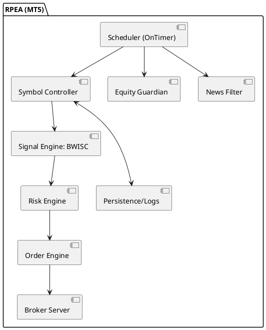

# SPEC-003 – FundingPips 10K RapidPass EA (RPEA) for MT5

## Background

Design an Expert Advisor (EA) to pass the **FundingPips 1-step \$10,000** challenge under these constraints: **target +10% (\$1,000)**, **max daily loss = `DailyLossCapPct` of CEST baseline**, **max overall loss = `OverallLossCapPct` of initial baseline**, **min 3 trading days**, **no time limit**, **leverage up to 1:50 FX / 1:20 metals**, and **no entry/close actions during high-impact news buffer** (policy clarified below). The EA aims to complete in **3–5 trading days** and be robust, auditable, and broker-compliant.

---

## Decisions & Constraints (LOCKED)

> These decisions are fixed to avoid mid-build refactors.

1. **News policy**

   * **Entries are blocked** within **±120s** of high-impact events that affect the symbol.
   * **Protective exits** (SL/TP/auto kill-switch/margin) are **always allowed** even inside the block.
   * **Discretionary closes** obey `MinHoldSeconds` **except** when kill-switch/margin rules trigger.

2. **Session order & scope**

   * Evaluate **London first**, then **New York** each day.
   * **One-and-Done is global across all symbols** for that day (a London win ≥ `OneAndDoneR` disables NY across the portfolio).

3. **NY gate rule**

   * NY session trading is allowed only if **realized day loss ≤ `NYGatePctOfDailyCap * DailyLossCapPct`** of today’s CEST baseline.
     Default: `NYGatePctOfDailyCap = 0.50`.

4. **Position & order caps**

   * Enforce inputs: `MaxOpenPositionsTotal`, `MaxOpenPerSymbol`, `MaxPendingsPerSymbol`.
     Defaults: **2 / 1 / 2**.

5. **Trading-day counting & persistence**

   * A trade day counts on the **first `DEAL_ENTRY_IN` between CEST midnights**.
   * Persist: `initial_baseline`, `gDaysTraded`, `last_counted_cest_date` so restarts don’t reset state.

6. **Kill-switch floors**

   * `DailyFloor = baseline_today − DailyLossCapPct%`. On breach: **close all**, **disable new entries until next CEST day**.
   * `OverallFloor = initial_baseline − OverallLossCapPct%`. On breach: **close all**, **disable permanently** for the challenge lifecycle.
   * Exits may bypass news/min-hold when floors are hit.

7. **Session window predicate**

   * `InSession(t0, ORMinutes) := TimeCurrent() ∈ [t0, t0 + ORMinutes*60]` (interval-based; **no hour-equality check**).

8. **Micro-fallback scope**

   * Micro-fallback trades **only run in Micro-Mode (post-target)** to tick min trade days; **never pre-target**.

9. **R / win calculation**

   * Persist `{entry, sl, type}` on open; compute `R` and win/loss on close from these persisted values (do **not** infer SL from closed positions).

10. **Helper surface (utility expectations)**

    * The shared utilities layer will expose: `IsNewsBlocked(symbol)`, `EquityRoomAllowsNextTrade()`, `MathSign()`, `MarkTradeDayOnce()`, `SpreadOK(sym)`.

11. **DST handling**

    * `ServerToCEST_OffsetMinutes` must be updated on DST flip (optionally add `AutoCEST` later).

---

## Requirements (MoSCoW)

**Must**

* Trade on **≥3 distinct trading days**; target **+\$1,000 in 3–5 days**.
* Drive deterministic scheduling via `OnTimer` (optionally `OnTradeTransaction`/`OnTick` for OCO/housekeeping).
* Enforce **configurable** drawdown caps everywhere via `DailyLossCapPct`, `OverallLossCapPct`. **No hard-coded 5/10%**.
* ATR-scaled SL/TP; auto lot sizing; **position/order caps**; equity guardian that **aggregates open & pending risk** before placing the next trade.
* At least one built-in indicator (ATR/RSI/MA) + session stats.
* Built-in **news filter** with **±120s** buffer and CSV fallback.
* Multi-symbol, multi-timeframe, low CPU; Strategy Tester-ready; **CEST-anchored day baseline** via `ServerToCEST_OffsetMinutes`.

**Should**

* Micro-Mode after +10% until `MinTradeDays` met; then **hard-stop**.
* OCO pendings; detailed CSV logs; retries for transient errors.

**Could**

* Equity curve throttle; per-symbol parameter sets.

**Won’t (MVP)**

* No grid, martingale, HFT, latency/arbitrage.

---

## Method

### Micro-Trade Days Mode (Post-Target)

* **Trigger:** equity ≥ **+10%** vs initial baseline.
* **Behavior:** enable **Micro-Mode** until `DaysTraded ≥ MinTradeDays (≥3)`, then **disable trading**.
* **Risk:** **0.05–0.20%** per trade (default **0.10%**), **one trade only** per remaining day.
* **Time-stop:** **30–60 min** (default 45 min) if not progressing.
* **Give-back cap:** if intraday **peak→current drawdown ≥ 0.25–0.50%** (default **0.50%**), **close & disable for the day**.

### Session Governance (London + New York, One-and-Done)

* Default: run **both** sessions; **evaluate London first**.
* **One-and-Done (global):** if London win **≥ `OneAndDoneR`**, **end the day** (no NY across all symbols).
* **NY Gate:** allow **one NY attempt** only if **realized day loss ≤ `NYGatePctOfDailyCap * DailyLossCapPct`**; else block to protect the daily cap.
* Toggle: `UseLondonOnly` to run London only.

---

## Synthetic Cross Support: **XAUEUR** (from **XAUUSD**, **EURUSD**)

**Goal:** Compute signals on **XAUEUR = XAUUSD / EURUSD** and execute either:

* **Proxy (default):** Execute only XAUUSD, size using synthetic SL dist mapped via current EURUSD.
* **Replication (optional):** Two legs to approximate XAUEUR delta.

  * Long XAUEUR ≈ **Long XAUUSD** + **Short EURUSD**; Short ≈ **Short XAUUSD** + **Long EURUSD**.
  * **Count both legs** toward drawdown/margin room; SL simulation must fit per-trade and daily/overall budgets.

**Synthetic prices & bars**

* Tick proxy: `P_synth = Bid(XAUUSD) / Bid(EURUSD)` (or Ask/Ask consistently).
* For ATR/MA/RSI: build **on-the-fly synthetic candles** from synchronized M1 OHLC; forward-fill short gaps.

**Delta-based replication volumes**

* For small moves: `d(XAUEUR) ≈ (1/E)dP − (P/E²)dE`.
* Choose `K` (USD P\&L per 1.0 XAUEUR unit) from `risk_money = K * |SL_synth|`.
  Then:
  `V_xau = K / (ContractXAU * E)`; `V_eur = K * (P / E²) / ContractFX`, with **ContractXAU=100 oz/lot**, **ContractFX=100,000**.

**Risk mapping & caps**

* **Proxy:** `sl_xau ≈ sl_synth * E`; convert to USD and size XAUUSD volume.
* **Replication:** Simulate worst-case at SL on **both legs**; ensure ≤ per-trade budget and **≤ rooms** (daily & overall).
* **Margin:** If estimated margin > **60%** free margin, **downgrade to proxy** or scale proportionally.

**News & compliance (synthetic)**

* Block entries if **either** leg has a high-impact event within ±120s (USD or EUR). Protective exits allowed.

---

## Original Strategy: **Burst-Weighted Imbalance with Session Confluence (BWISC)**

Focuses risk on **high-energy session bursts** or **measurable dislocations** from a rolling anchor, targeting **2.0–2.5R** payoffs.

**Core concepts**

* **ATR(D1)** for SL/TP scaling.
* **BTR** (Body-to-TrueRange) on **yesterday’s D1**: `|C[1]-O[1]| / max(H[1]-L[1], point)`.
* **Session Dislocation Ratio (SDR)** at London open: `|Open_LO - MA20_H1| / ATR(D1)`.
* **Opening Range Energy (ORE)** (first 60m of session): `range(H-L) / ATR(D1)`.
* **RSI(H1)** guard: avoid extreme overextension unless backed by strong dislocation.

**Bias score (−1..+1)**
`Bias = 0.45*sign(C1−O1)*BTR + 0.35*sign(Open_LO − MA20_H1)*min(SDR,1) + 0.20*sign(C1−O1)*min(ORE,1)`

**Setups**

* **|Bias| ≥ 0.6 → BC:** Stop beyond OR extreme; ATR SL; **target 2.2R**.
* **|Bias| ∈ \[0.35,0.6) & SDR ≥ 0.35 → MSC:** Limit toward MA20\_H1; SL beyond dislocation; **target 1.8–2.2R**.
* Else: **no primary setup**.

**Why it can pass quickly**

* With **1.5% risk** and **2.2R**, a win ≈ **+3.3%**. **\~3 wins** across **3–5 days** ≈ **+10%** while caps constrain downside.

---

## Rules of Engagement (per symbol)

1. Evaluate at **London** and (if allowed) **NY** windows.
2. If `|Bias| ≥ 0.6` → **BC**: stop entry beyond OR extreme. `SL = ATR*SLmult`, `TP = SL*RtargetBC`, `buffer = EntryBufferPoints`.
3. Else if `|Bias| ≥ 0.35` and `SDR ≥ 0.35` → **MSC**: limit entry toward MA20\_H1. SL beyond dislocation; `TP = SL*RtargetMSC`.
4. **Cancel unfilled pendings** at session end or **CutoffHour**.
   If no fill **and Micro-Mode is active**, place **micro-fallback** trade (≤ `MicroRiskPct`).
5. **Trailing** activates after **+1R**: trail at `ATR*TrailMult`.
6. **Risk allocator**: per-trade risk ≤ clamp; **budget gate** ensures next trade cannot exceed **daily/overall** rooms.

---

## News Compliance

* Use MQL5 **Economic Calendar** where available; else CSV fallback.
* **Entries blocked** from **T−120s → T+120s** for **high-impact** events affecting the symbol (and both legs for synthetic).
* **Protective exits always allowed** (SL/TP/kill-switch/margin).
* **Discretionary closes** respect `MinHoldSeconds` unless kill-switch/margin rules require immediate exit.

### News-window behavior (for any affected symbol/leg) in [T−NewsBufferS, T+NewsBufferS]

1. Blocked actions
   - Do NOT send new orders (market or pending).
   - Do NOT call PositionModify/OrderModify (incl. trailing, SL/TP moves, partial closes).
   - Do NOT delete/replace orders EXCEPT where noted below as risk-reducing.

2. Queued actions
   - Queue any trailing updates or planned SL/TP optimizations.
   - Apply the queued changes only after T+NewsBufferS if:
     - the position/order still exists,
     - the setup precondition still holds (e.g., ≥ +1R for trailing), and
     - you are not inside a subsequent news window.
   - Stale queue items are dropped after a TTL (see `QueuedActionTTLMin`).

3. Allowed exceptions (risk-reducing/protective only)
   - Protective exits: kill-switch on Daily/Overall floor breach, margin protection. (Allowed anytime.)
   - Broker-side SL/TP hits: always allowed. Log as `NEWS_FORCED_EXIT`.
   - OCO safety: if a sibling pending would increase risk after an unexpected fill, you MAY delete that sibling pending (order cancel only). Log as `NEWS_RISK_REDUCE`.
   - Replication safety: if one leg of a synthetic replication hits SL/TP, you MAY close the other leg immediately to neutralize residual delta. Log as `NEWS_PAIR_PROTECT`.

---

## Architecture Components

* **Scheduler (OnTimer 30–60s):** session windows, CEST day rollover, news blocks, cutoffs, governance.
* **Symbol Controller:** per-symbol state (indicators, OR levels, last trade metadata).
* **Signal Engine (BWISC):** computes BTR/SDR/ORE/RSI → bias → BC/MSC/none with candidate SL/TP.
* **Risk Engine:** lot sizing from risk%, ATR-based SL distance; **budget gate** against daily/overall rooms; margin checks; **position caps**.
* **Order Engine:** OCO pendings; market fallbacks; modify SL/TP; trailing; partial fills; atomic two-leg ops for replication.
* **Equity Guardian:** daily baseline, initial baseline, floors; pauses/disable flags.
* **News Filter:** calendar queries; per-symbol impact map; CSV parser fallback.
* **Persistence/Logs:** file-backed state (challenge progress), CSV audit logs, restart recovery.

### Component Diagram (PlantUML)



### Data Flow & Sequence (per trading window)

```plantuml
@startuml
actor Trader as U
participant Scheduler
participant News
participant SymCtl
participant Signal
participant Risk
participant Order
participant Equity

Scheduler->Equity: Check daily/overall room
Equity-->Scheduler: OK / Pause
Scheduler->News: IsBlockedNow(symbol)?
News-->Scheduler: Yes/No
alt Blocked or No Room
  Scheduler->SymCtl: Skip window
else Proceed
  Scheduler->SymCtl: Build session stats (OR, MA20_H1)
  SymCtl->Signal: Compute Bias (BTR, SDR, ORE, RSI)
  Signal-->SymCtl: Proposal (BC/MSC/None) with SL/TP candidates
  SymCtl->Risk: Calc volume within caps & margin (budget gate)
  Risk-->SymCtl: volume, prices
  SymCtl->Order: Place pending (OCO) with expiry; or market fallback
  Order-->SymCtl: tickets/retcodes
end
Order-->Persistence/Logs: audit rows
@enduml
```

---

## Key Algorithms & Formulas

### Synthetic XAUEUR Specifics

* **Price:** `P_synth = XAUUSD / EURUSD` using consistent side (Bid/Bid or Ask/Ask).
* **Indicators on synthetic:** build synthetic OHLC from synchronized M1 bars; compute ATR(D1)/MA20(H1)/RSI(H1).
* **Replication sizing:** choose `K = risk_money / SL_synth`;
  `V_xau = K / (ContractXAU * E)`, `V_eur = K * (P/E²) / ContractFX`.
  Validate worst-case combined loss at SL (both legs).

### Equity & Risk Caps (with floors)

* **Day anchor (CEST):** `baseline_today = max(balance_at_midnight_CEST, equity_at_midnight_CEST)`.

* **Room today:** `(DailyLossCapPct/100) * baseline_today − (baseline_today − current_equity)`.

* **Room overall:** `(OverallLossCapPct/100) * initial_baseline − (initial_baseline − current_equity)`.

* **Per-trade risk clamp:** use rooms exclusively (no fixed 5/10).

* **Budget gate:** `open_risk + pending_risk + next_trade_worst_case ≤ 0.9 * min(room_today, room_overall)`.

* **Floors:**
  `DailyFloor = baseline_today − DailyLossCapPct%`; `OverallFloor = initial_baseline − OverallLossCapPct%`.
  Breach ⇒ close all; disable (per-day or permanent).

* **Small-room guard:** if `room_today < MinRiskDollar`, pause for the day.

### Position/Order Caps

* Before placing any order: assert
  `OpenPositionsTotal < MaxOpenPositionsTotal` and
  `OpenPositionsBySymbol(sym) < MaxOpenPerSymbol` and
  `OpenPendingsBySymbol(sym) < MaxPendingsPerSymbol`.

### Sizing by ATR distance

* `risk_money = equity * risk_pct`
* `sl_points = max(|entry - stop| / _Point, MinStopPoints)`
* `value_per_point = (SYMBOL_TRADE_TICK_VALUE) / (SYMBOL_TRADE_TICK_SIZE / _Point)`
* `raw_volume = risk_money / (sl_points * value_per_point)`
* Normalize to broker limits; guard **≤60%** of free margin.
* Market orders should respect `MaxSlippagePoints` where applicable.

### Session Statistics

* **Opening Range (OR):** first **60 min** (configurable) high/low on **M5**.
* **MA20\_H1:** EMA(20) on H1 close.
* **ATR\_D1:** ATR(14) on D1.
* **RSI\_H1:** RSI(14) on H1.

### News Filter (±120s)

* Prefer MQL5 Calendar API; fallback CSV `timestamp,impact,countries,symbols`.
* Map events to symbols (including both legs for synthetic).

---

## Inputs (consolidated)

**Risk & governance**

* `DailyLossCapPct` (default **3.0**)
* `OverallLossCapPct` (default **6.0**)
* `MinTradeDaysRequired` (default **3**)
* `TradingEnabledDefault` (default **true**)
* `MinRiskDollar` (default **\$10**) – minimum room to allow new trade
* `OneAndDoneR` (default **1.5**)
* `NYGatePctOfDailyCap` (default **0.50**) – fraction of daily cap that may be lost and still allow NY

**Sessions & micro-mode**

* `UseLondonOnly` (default **false**)
* `StartHourLO` (default **7** server time)
* `StartHourNY` (default **12** server time)
* `ORMinutes` (default **60**; options {30,45,60,75})
* `CutoffHour` (default **16** server hour)
* `RiskPct` (default **1.5**)
* `MicroRiskPct` (default **0.10**; range 0.05–0.20)
* `MicroTimeStopMin` (default **45**; range 30–60)
* `GivebackCapDayPct` (default **0.50**; range 0.25–0.50)

**Compliance**

* `NewsBufferS` (default **120**)
* `MaxSpreadPoints` (default **40**)
* `MaxSlippagePoints` (default **10**)
* `MinHoldSeconds` (default **120**)
* `QueuedActionTTLMin` (default **5**) – minutes to keep queued trailing/SL-TP updates before dropping

**Timezone**

* `ServerToCEST_OffsetMinutes` (default **0**; update on DST)

**Symbols & leverage**

* `InpSymbols` (default `"EURUSD;XAUUSD"`)
* `UseXAUEURProxy` (default **true**)
* `LeverageOverrideFX` (default **50**; `0` to use account)
* `LeverageOverrideMetals` (default **20**)

**Targets & mechanics**

* `RtargetBC` (default **2.2**)
* `RtargetMSC` (default **2.0**)
* `SLmult` (default **1.0**)
* `TrailMult` (default **0.8**)
* `EntryBufferPoints` (default **3** points)
* `MinStopPoints` (default **1** point)
* `MagicBase` (default **990200**)

**Position / order caps**

* `MaxOpenPositionsTotal` (default **2**)
* `MaxOpenPerSymbol` (default **1**)
* `MaxPendingsPerSymbol` (default **2**)

---

## Implementation Roadmap

* **M1 (Week 1)** – Project skeleton, inputs, state structs, scheduler, logging; indicator handles; news fallback parser; persistence scaffolding.
* **M2 (Week 2)** – Signal Engine (BWISC): BTR/SDR/ORE/Bias; session stats; risk sizing with equity caps; margin guard; position caps; budget gate.
* **M3 (Week 3)** – Order Engine: OCO pendings, market fallback with slippage, trailing, partial-fill handling; synthetic manager; two-leg atomicity.
* **M4 (Week 4)** – Compliance polish: calendar integration; CEST day tracking; min trade days; kill-switch floors; disable flags; persistence hardening.
* **M5 (Week 5)** – Strategy Tester artifacts: `.set` for \$10k; optimization ranges; walk-forward scripts; CSV audit/reporting.
* **M6 (Week 6)** – Hardening: market closure/req-reject paths; parameter validation; restart/idempotency; perf profiling; code review.

---

## Backtesting & Optimization Guidance (MT5)

**Tester setup**

* **Deposit:** \$10,000; **leverage:** 1:50 FX / 1:20 metals (override per symbol if needed).
* **Model:** *Every tick based on real ticks* for fills; *1-minute OHLC* for coarse sweeps.
* **Period:** recent 3–6 months; include high-impact news weeks.
* **Symbols:** start `EURUSD`, `XAUUSD`; optionally add 1–2 majors.

**Optimization targets**

* Primary: **reach +10% within 3–5 trading days** with **0 cap violations**.
* Secondary: Profit Factor, Max Drawdown, Trade Days ≥ 3.

**Key ranges**

* `RiskPct` ∈ \[0.8, 2.0]; `MicroRiskPct` ∈ \[0.05, 0.20]
* `SLmult` ∈ \[0.7, 1.3]; `RtargetBC` ∈ \[1.8, 2.6]; `RtargetMSC` ∈ \[1.6, 2.4]
* `ORMinutes` ∈ {30, 45, 60, 75}
* Thresholds: Bias cut \[0.5, 0.7]; SDR cut \[0.25, 0.5]; RSI guard \[35, 70] or \[30, 68]
* `TrailMult` ∈ \[0.6, 1.2]; Session choice: London vs New York vs both

**Validation**

* Walk-forward (month-in / 2 weeks-out).
* Ensure **no single day** exceeds `DailyLossCapPct` of that day’s baseline.
* Confirm **≥3 distinct calendar trade days**; when target is reached earlier, verify **Micro-Mode** days tick the requirement.

---

## Scalability & Robustness

* Multi-symbol loop with per-symbol state; `OnTimer` every 30s; heavier work at session starts/ends/cutoff.
* Respect symbol properties (`SYMBOL_TRADE_TICK_VALUE`, `_Digits`, `SYMBOL_VOLUME_STEP`, `SYMBOL_TRADE_STOPS_LEVEL`).
* Margin reserve: keep order placement under **60%** of free margin.
* Persistence to recover after terminal restarts; idempotent order reconciliation on init.
* CSV logs for all decisions (budget gate, news blocks, governance, OCO, floors).

---

## Trade-Offs & Risk Mitigations

* **Speed vs Safety:** Higher R targets speed the pass but lower win rate. Use **1–2%** risk per trade under strict caps; stop when daily room is low.
* **Metals leverage:** Metals move well but at **1:20** margin; prioritize FX when margin-constrained.
* **News window:** ±120s can skip moves; consider **post-news 5–10m re-entry** rule (outside MVP).
* **Model drift:** Non-stationarity may degrade bias logic; bound parameters, walk-forward regularly.
* **Slippage/gaps:** Use ATR-based SL; `EntryBufferPoints`; slippage caps on market fallbacks.

---

## Gathering Results

* **Pass simulation criteria:** Net P/L **≥ +\$1,000**, **0 violations** of daily/overall drawdown, **trade days ≥ 3**.
* **Operational:** No entry during blocked news; CPU < 2% on VPS; logs/audit complete.
* **Performance:** Backtest across multiple months and forward demo; expectation ≠ guarantee.

---

**This locked spec is ready for production implementation.**
